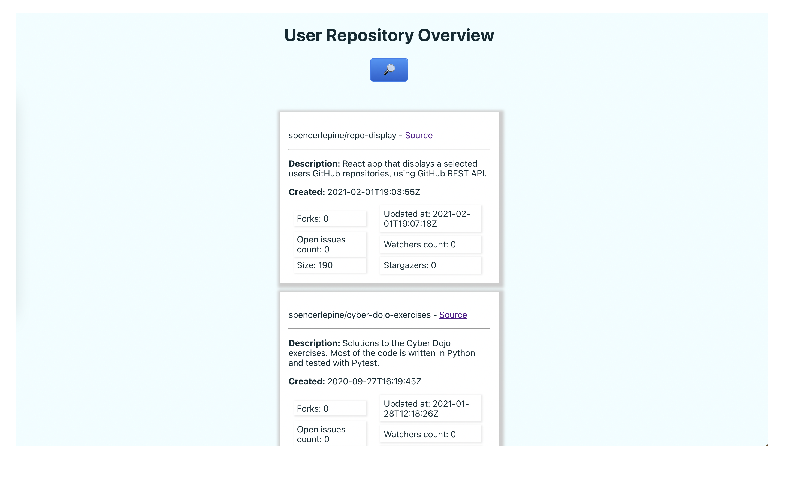

# GitHub User Repo Overview

## Description:
This React App allows the user to type a username get an overview of their GitHub repos.

## Details:
Using class components with React, the username search feild can pass the value to the repoCard component. After a search is executed, the DisplayCards component will exectute the Fetch call an determine if this is a real user. The repoCard interpret repository data and displays it dynamically.